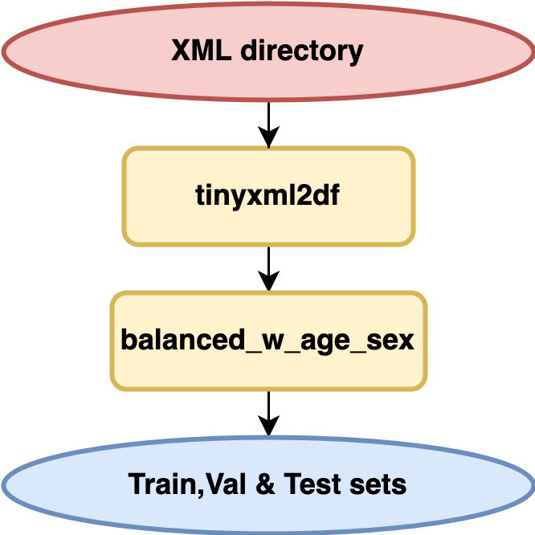

## DeepECG Repo

#### tinixmltodict: 

Class that takes in a path of xml and transforms all the xml into a dict without removing any info, concatenates potential human-specific errors during entry for diagnostics (cols -1 and -2). Should take ~20-25 mins to run. 

To run:

`df = tinyxml2df("path_to_xml").read2flatten(verbose=True, output_dir=os.getcwd(), save=False)`
